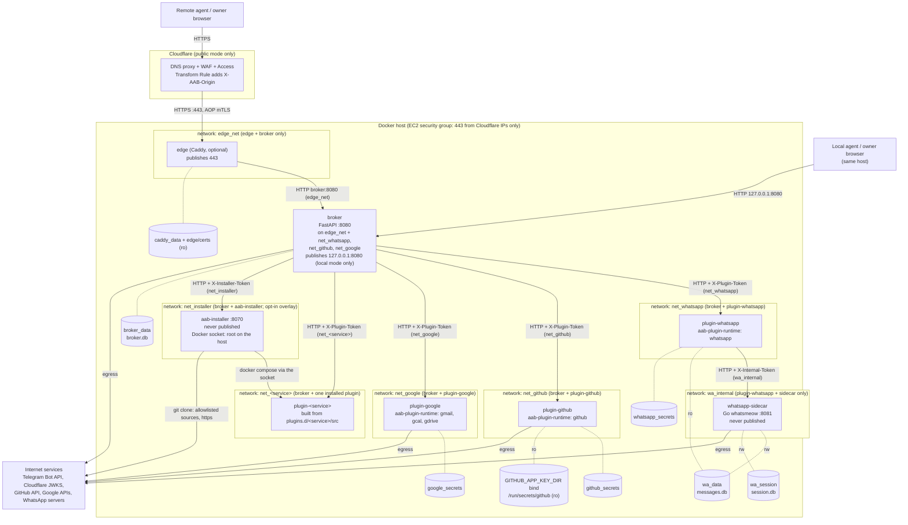
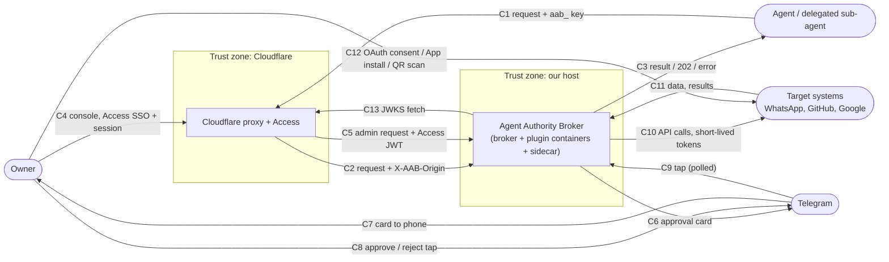
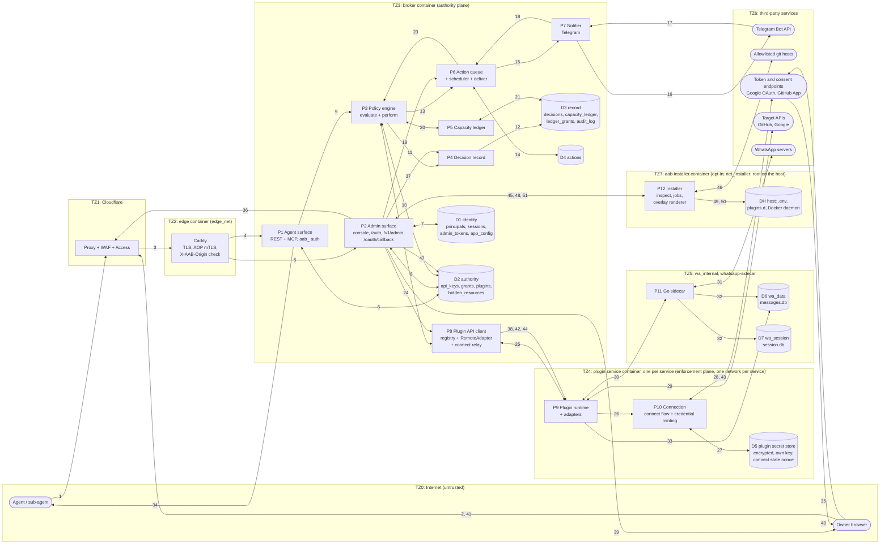

# Architecture

This document describes the Agent Authority Broker as the implementation plan
defines it for v0.2.0: what the system is for, how it is deployed, how data
moves through it, and where the trust boundaries are. It is written for two
readers: a newcomer who needs a mental model, and whoever writes the threat
model (the numbered flows in section 3 and the boundary notes in section 4 are
meant to be that exercise's input).

Everything here describes the **target state** of the plan (implementation
plan, "Deployment: one container per plugin", decided 2026-09-24, including
its "Resolved open points") and of the decisions taken since: third-party
credentials are entered in the console (`docs/configuration.md`), and the
broker passes the OAuth redirect URI to the plugin (section 1.7). Where older
text in the plan predates these (for example `PLUGIN_TOKEN_<ID>` keyed by
plugin id, OAuth state kept in the broker, or a `TELEGRAM_BOT_TOKEN` env
var), this document follows the decisions. Every phase the plan builds for
0.2.0 is merged; [Current build status](#6-current-build-status) lists what
is merged and what still has to be verified before the tag.

Contents

1. [System description](#1-system-description)
2. [Deployment topology](#2-deployment-topology)
3. [Data flow diagrams](#3-data-flow-diagrams)
4. [Security notes per trust boundary](#4-security-notes-per-trust-boundary)
5. [Glossary](#5-glossary)
6. [Current build status](#6-current-build-status)
7. [Open points](#7-open-points)

---

## 1. System description

### 1.1 Purpose

AI agents need to work in real systems (a WhatsApp account, GitHub repos, a
Gmail inbox, a calendar, a Drive). The usual way to allow that is to hand the
agent a credential, which gives it all of that credential's authority and
leaves no record of which human's authority a given action used.

The broker replaces that pattern:

- **Agents hold no target credentials.** An agent holds only an `aab_` key,
  which is useful against the broker and nothing else.
- **Every call is decided live.** The broker computes what the key may do *now*
  and allows, drafts (queues for a human) or denies the call.
- **Grants can only narrow.** An agent can ask for more (a human approves) or
  hand a sub-agent less (no human needed), but no operation exists that widens
  authority.
- **Every decision is recorded** with its full authority chain in a
  hash-chained, HMAC-signed decision record.

The pitch in the brief is accountability infrastructure: access control is the
mechanism that produces the evidence.

### 1.2 The authority formula

```
effective(key, t) = P(owner, t)  ∩  G(grant chain, t)  ∩  R(role)   − denies
```

| Term | Meaning in v0.2.0 |
|---|---|
| **P(owner, t)**, the ceiling | Everything the owner can reach *right now*: for every plugin that is **enabled and connected**, all actions, every selector `"*"`, mode `direct`, no expiry or budget. It is virtual (computed, never stored), so disabling or disconnecting a plugin removes it from every agent in the same instant. |
| **G(grant chain, t)** | The union over the key's active, unexpired grants of the *chain meet*: the grant met with its parent, grandparent, up to the root. If any link in a chain is not active and unexpired, that chain contributes nothing. The stored child row is never trusted on its own; the chain is re-walked on every call. |
| **R(role)** | The key's ceiling. It never grants; it caps every capability below it: `read-only` (writes and destructive actions denied), `read-draft` (writes and destructive actions only as drafts), `read-act` (destructive actions only as drafts), `full` (caps nothing: the capabilities decide; the default for owner-created keys). |
| **denies** | Outside the lattice, subtracted last: owner-level `hidden_resources` and the key's own `api_keys.denies` (for a delegated key: its parent's denies plus its own). A hidden or denied resource answers **404**, exactly like a missing one. |

In the brief the first term is `P(principal)`. v0.2.0 has a single principal
(the owner) and no identity provider, but every table carries `principal_id`
and the decision record carries the chain, so multiple principals can be added
later without changing the model.

### 1.3 Actors

| Actor | What it is | How it authenticates |
|---|---|---|
| **Owner** | The one human principal. Creates keys and grants, approves drafts and permission requests, enables plugins, connects target accounts. | Console password login (`aab_session` cookie) or an owner-minted `aab_admin_…` token; in public mode also a Cloudflare Access identity. Telegram taps, once the Telegram account is linked. |
| **Agent** | Any AI client (Claude over MCP, a script over REST). | `Authorization: Bearer aab_…` |
| **Delegated sub-agent** | An agent holding a child key minted by another agent via `delegate`. Same surface; its authority is a strict narrowing of its parent's. | `Bearer aab_…` (child key; dies with its parent) |
| **Target systems** | WhatsApp (via the Go sidecar), GitHub, Google (Gmail, Calendar, Drive). | Reached only by plugin containers, with short-lived credentials they mint themselves. |
| **Approval channel** | The console, and optionally a Telegram bot. Shows approval cards; the owner's tap is an admin action. | Telegram bot token (entered by the owner in the console, encrypted under `BROKER_SECRETS_KEY`; used outbound only); the tapping Telegram user must be the linked owner. |

### 1.4 Two planes

The brief separates the system into two planes; the deployment makes that
separation physical.

- **Authority plane = the `broker` container.** Owner account, keys, grants,
  roles, hidden resources, the policy engine, the decision record, the
  capacity ledger, the queue of drafts and scheduled actions, the notifier,
  the REST and MCP surfaces, and the console. This is the policy decision point.
- **Enforcement plane = one container per plugin service, plus native
  sidecars.** A *plugin service* is a container that hosts one or more plugin
  ids: `plugin-whatsapp` (plugin `whatsapp`, with the Go `whatsapp-sidecar`
  behind it), `plugin-github` (`github`), `plugin-google` (`gmail`, `gcal` and
  `gdrive`, one container because they share one OAuth credential). Each runs
  the `aab-plugin-runtime` package hosting Python adapters, holds its own
  target credentials encrypted under its own key, runs its own connect flow
  (OAuth, App install, QR pairing), and exposes a small internal plugin API to
  the broker. The broker's registry maps plugin id → service.

**What the broker holds:** the owner's password hash, hashes of session
cookies, admin tokens and agent keys; grants and denies; the decision record
and its `DECISION_SIGNING_KEY`; the Telegram bot token and the installer's
read-only GitHub token for private plugin repositories (both entered in the
console, encrypted in `plugin_secrets` under `BROKER_SECRETS_KEY`); one
`PLUGIN_TOKEN_<SERVICE>` per plugin service (`WHATSAPP`, `GITHUB`, `GOOGLE`) so
it can call the plugin API.

**What the broker does NOT hold:** any target credential. No OAuth client
secret, no Google refresh or access token, no GitHub App private key or
installation token, no WhatsApp session, no `SIDECAR_TOKEN`, no
`PLUGIN_SECRETS_KEY_<SERVICE>`. It cannot reach the sidecar or the WhatsApp
archive. The broker sends *requirements* ("a token with `gmail.readonly`",
"repos `a/b`, `contents:read`") and the plugin mints the credential. During a
connect flow the broker relays an OAuth authorization code to the plugin once
and keeps nothing.

Consequence for the threat model: compromising the broker yields the ability
to *ask* every plugin to act (it holds every `PLUGIN_TOKEN_<SERVICE>`), bounded
by what each plugin's connection can mint, but it does not yield standing
target credentials that could be used from elsewhere.

### 1.5 Lifecycle of one call

An agent calls `POST /v1/targets/gmail/actions/search_threads` (or the MCP tool
`gmail_search_threads`; both go through the same `engine.perform`).

1. **Authenticate.** Edge checks (public mode), then `aab_` bearer lookup by
   hash, rotation grace, key not disabled or expired, and every ancestor key
   in the delegation chain alive. Any failure is 401.
2. **Evaluate** (`policy.evaluate`). Params that cannot be encoded as UTF-8
   JSON (a lone surrogate, NaN, Infinity) are a recorded 400
   `invalid_params` before evaluation starts. Plugin enabled (else a
   404-shaped deny); action exists and params validate, from the manifest
   alone. Plugin connected: if not, the key's capabilities are computed as
   if it were and checked against the raw (trimmed) selector value, and
   only a key that some capability covers gets 503 `not_connected`; every
   other key gets the same 403 it would get while connected, so a key
   without authority cannot learn whether a plugin is paired. Then
   `effective()` is computed live, and a key none of whose capabilities
   reaches the action gets its 403 before the plugin is asked anything.
   The selector parameter is normalized (via the plugin's `/normalize`; a
   plugin that cannot be reached is 503 `plugin_unavailable`, again only
   for a key covered on the raw value); the first capability covering
   target + action + resource wins, and a hidden or denied resource is then
   404. None covers it: deny 403 `out_of_grant`. Capability mode `draft` or
   the caller's `as_draft=true` or a `run_at`: draft. Otherwise allow.
   `enforced_where` is filled per bounding dimension. The full order is the
   docstring of `broker/broker/policy.py`.
3. **Decision record.** A `decision` row (allow, draft or deny, with the grant
   chain root to leaf, `params_hash`, reason, `enforced_where`) is appended to
   `decisions` **before any side effect**, including for denies.
4. **Deny** returns the error. **Draft** goes to the action queue (step 1.6)
   and the agent gets 202 `pending_approval` or `scheduled`.
5. **Ledger.** For an allowed write, the per-key per-minute limiter is checked
   and `capacity_ledger` reserves one charge per grant in the chain
   (`ledger_grants`). An exhausted budget is 429 naming the grant.
6. **Plugin perform.** The broker's `RemoteAdapter` sends `POST /perform` to the
   plugin container with params and a `CallScope` (visibility deny set and
   optional `allow_only`, constraints, credential requirements, `request_id`).
   The plugin mints or reuses a narrowly scoped token and calls the target.
7. **Outcome.** The result (filtered again by the engine for any row naming a
   hidden resource) goes back to the agent; an `outcome` row is appended to
   `decisions`; the ledger reservation is committed. A **503** from the plugin
   means "not delivered, safe to retry" and releases the reservation; a
   **502** means "outcome unknown", keeps the reservation for 24h, and is never
   retried automatically.

Two REST response rules sit on top of this (`docs/plugin-api.md`). A binary
result is served as an attachment (`Content-Disposition: attachment`, named
after the call's most specific id) with `X-Content-Type-Options: nosniff`.
A long-poll read (`GET …?wait=N`) is held until something is new, except a
*bootstrap*: a `long_poll` action that declares a `cursor`, called without
one, is answered at once whatever `wait` says, so nothing that arrives
during the wait is skipped. MCP returns binary results as base64 content
and never waits.

### 1.6 Lifecycle of one draft

1. **Queue.** `actions.queue.create` is the single choke point: it inserts an
   `actions` row (`status=pending`, or `scheduled` for an already-allowed call
   with `run_at`) linked to its `decision_id`, and calls `notify.notify_action`.
2. **Notify.** The console's `requests` view shows it, rendered from the
   manifest's `summary_template`; if Telegram is linked a card with
   approve and reject buttons is sent to the owner.
3. **Human decision.** The owner approves or rejects in the console (session or
   admin token) or taps in Telegram. Each path produces an `AdminContext`
   (principal, surface `session | token | telegram`), and the row records
   `decided_by_principal` (the owner's username) and `decided_via`. Status
   moves only by atomic `UPDATE … WHERE status=?`, so a double tap cannot
   deliver twice.
4. **Deliver with re-check** (`actions/deliver.py`, also run by the scheduler
   for due `run_at` rows). A human-approved row still needs the key alive, the
   plugin enabled, and the resource not hidden. A row that no human approved
   (`approval_source=automatic`) re-runs `evaluate` and needs `allow`. Rows for
   a disabled plugin are *held*, not dropped; approving a held action is 409.
   Delivery then follows steps 5 to 7 of the call lifecycle, and pending
   drafts expire after their TTL.

### 1.7 Plugin enable and disable, hidden resources, delegation

- **Enable/disable** is a broker-side flag in the `plugins` table (every
  discovered plugin starts disabled). Enabling validates config against the
  manifest's `config_schema`, relays secret fields once to the plugin's
  `/configure`, and stores `/status` as `last_health`. Disabling makes that
  plugin's MCP tools, REST routes and skill section vanish on the next request
  and holds its queued actions; the plugin keeps its secrets. A plugin
  container that is down shows as unhealthy; its tools only vanish when it is
  disabled.
- **Connect and disconnect** run inside the plugin service. The console calls
  `/v1/admin/plugins/{id}/connect/start`; the broker relays to the plugin's
  `POST /connect/start {enabled_plugins, redirect_uri?}`, which answers
  `{kind: oauth|install|qr|none, url?, state?}`.
  The OAuth redirect URI is the broker's `GET /oauth/callback/{service}`.
  Only the broker knows how the owner reaches it, so the broker computes it
  (public mode: `https://<SITE_DOMAIN>/oauth/callback/<service>` from its
  own env; local mode: the loopback address the console used) and passes it
  as `redirect_uri`; the plugin stores it beside the `state` nonce and
  reuses it for the code exchange (decided; implemented with phase 7).
  For Google the plugin builds the auth URL from its own client id, that
  `redirect_uri` and scopes = the union of its enabled manifests'
  `target_permissions`, and generates and stores the `state` nonce itself
  (plugin-side, in its own secret volume; valid for 10 minutes and single
  use, consumed by the first `/connect/finish` that presents it); for GitHub
  it returns the App install URL (same nonce rules); for WhatsApp it returns
  `{kind: qr}` (`{kind: none}` once paired) and the console shows
  `GET /v1/admin/plugins/whatsapp/connect/qr.png`, which the broker proxies
  from the plugin's `GET /connect/qr.png` (itself proxied from the sidecar).
  The callback page needs no owner credential (Cloudflare Access still
  applies in public mode): the provider's redirect is cross-site, so the
  SameSite=Strict session cookie is not sent on it. The page holds no data;
  it strips `code` and `state` from the address bar and POSTs them, same
  origin, with the session cookie and the CSRF header, to the admin-guarded
  `/v1/admin/plugins/{service}/connect/finish` (without a live session it
  asks the owner to log in in another tab and retry), and the broker relays
  them once to the plugin's `POST /connect/finish`
  (GitHub: `installation_id`). The plugin exchanges the code with its own
  client secret and stores the credential in its own volume. GitHub sends
  the owner back to the one Setup URL registered on the App, not to a URL
  passed per request; where that redirect cannot reach the broker (a
  local-only deployment that did not register its loopback callback), the
  console's GitHub panel finishes with the installation id typed in, plus
  the `state` that `connect/start` issued. For WhatsApp,
  `/connect/finish` is a no-op that makes the broker refresh health.
  `disconnect` relays to `POST /disconnect`, which wipes the credential
  (WhatsApp answers 409: the plugin mounts the session read-only, so the
  owner unlinks the device on the phone and the sidecar re-pairs).
- **Hidden resources** (`hidden_resources`, by target, kind and normalized id)
  apply to every key. The label is display-only; enforcement is by id, so
  renaming a chat or repo can never unhide it. Hidden resources are 404 on
  get, filtered from every list at the adapter boundary, and filtered again
  by the engine; `get_my_access` never lists them.
- **Delegation.** `delegate(name, capabilities, expires_in_hours, reason)`
  creates a child `api_keys` row (`parent_key_id` set, role, rate and expiry
  no wider than the parent's, denies a superset of the parent's) and one
  `kind=delegation` grant per parent grant, produced by `narrow()`. Depth is
  capped by `max_delegation_depth` (3). No human is involved because nothing
  widens. `revoke_delegation` disables a descendant and revokes its grants;
  its own descendants die through the chain walk. The console's Delegations
  view does the same for the owner, in two steps (section 7). Scope
  *expansion* (`request_permission`) is the one
  human interrupt besides drafts: it creates a `pending` `expansion` grant,
  clipped to what the parent (or the ceiling, for a root key) could give.

### 1.8 Structural guarantees

These are enforced by the shape of the code, not by a policy check that could
be misconfigured:

- **No approve tool for agents.** Neither MCP nor REST exposes approval to an
  `aab_` key, and Telegram has no agent-facing approve path. A test asserts
  `services/admin.py` is unreachable from `mcp_server.py`'s import graph.
- **Child grants only via `narrow()`.** The store's child-insert path accepts
  only a `NarrowedCapabilities` value, whose constructor needs a module-private
  sentinel; `grant_le(child, parent)` is asserted as a post-condition. Every
  capability is an allow statement in a meet-semilattice, so "widen" has no
  representation. Hypothesis property tests check that widening is unreachable.
- **Chains re-walked on every call.** Revoking any link, disabling a parent key
  or editing a root grant narrower propagates to every descendant with no
  cascade writes.
- **Hidden == 404.** A hidden or denied resource is indistinguishable from a
  missing one.
- **503 vs 502.** "Not delivered" and "unknown outcome" are different statuses
  end to end, so a send is never silently duplicated by a retry.
- **Manifests are pinned.** The registry validates every manifest a plugin
  service returns from `GET /manifests` against the vendored copy in `targets/<id>/manifest.yaml` (id and version
  must match), so a plugin cannot widen its declared lattice at runtime.
- **Decision before side effect.** The decision row exists before the plugin
  is called, so an action without a record cannot happen through the engine.

---

## 2. Deployment topology

### 2.1 Containers, networks, ports and volumes

One Docker Compose project. The base file is local-only; the public overlay
adds the Caddy `edge` and removes the broker's host port.



Notes:

- **Published ports.** Local mode: only `127.0.0.1:${BROKER_PORT:-8080}` (the
  broker, loopback only). Public mode: only `443` (the edge); the broker's
  host port is removed (`ports: !reset []`). No plugin port and no sidecar
  port is ever published.
- **Networks.** Five in every deployment, each carrying exactly one kind of
  traffic: `edge_net` (edge ↔ broker), one network per plugin service
  (`net_whatsapp`, `net_github`, `net_google`: the broker ↔ that one
  service) and `wa_internal` (plugin-whatsapp ↔ sidecar). With the opt-in
  installer, `net_installer` (broker ↔ `aab-installer` only), and one
  `net_<service>` per installed external plugin (broker ↔ that plugin only,
  rendered by the installer, never supplied by the plugin's repository). The broker is on
  every network except `wa_internal`; the only other container on two
  networks is plugin-whatsapp (its own and `wa_internal`). So the edge
  cannot reach any plugin, and a compromised edge cannot call `/perform`;
  no plugin service can reach another (a compromised plugin-github cannot
  even resolve plugin-google's name, let alone open a connection to its
  API); the broker cannot reach the sidecar. None of
  the networks blocks egress: plugins, the sidecar and the broker
  (Telegram, Cloudflare JWKS) need outbound internet.
- **Volumes.** `broker_data` (broker only); `wa_data` (the archive,
  `messages.db`: sidecar read-write, plugin-whatsapp read-only, nobody else;
  the broker never mounts it); `wa_session` (whatsmeow's `session.db`, the
  WhatsApp credential: the sidecar alone, read-write, so no other container
  can read the session); one
  secret volume per plugin service, mounted at `/secrets` by that service only:
  `whatsapp_secrets`, `github_secrets`, `google_secrets`; `caddy_data` and the
  `edge/certs` bind mount (edge only). Compose prefixes each with the project
  name (`aab_broker_data`, ...). Named volumes rather than bind mounts, because
  SQLite WAL locking is unreliable over Docker Desktop's NTFS sharing.
- **GitHub App key bind.** Optionally, `plugin-github` (and nothing else) also
  mounts the host directory `${GITHUB_APP_KEY_DIR:-./data/github-app}`
  read-only at `/run/secrets/github`, so the App private key can be supplied as
  a file (the plugin's `private_key_path` field pointed at
  `/run/secrets/github/app.pem`) instead of being pasted in the console. The
  plugin reads only a file that resolves (symlinks followed) inside that
  directory, on configure and on every read, so a console session cannot
  turn the field into a read of any other file. The host directory is
  git-ignored and should be readable only by uid 10001.
- **The plugin installer** (opt-in, `docker-compose.installer.yml`, loaded when
  `INSTALLER_ENABLED=true`): `aab-installer` mounts the Docker socket (the
  only container that does, so it is root on the host) and the checkout at
  `AAB_HOME`, at the same path as on the host. It shares `net_installer` with
  the broker alone, publishes nothing, and clones only allowlisted sources;
  it owns `plugins.d/`, from which each installed plugin is built and whose
  rendered `compose.yml` joins the compose file set
  (`scripts/compose-files.sh`). Section 4.1 has the boundary.
- Every image runs as a non-root user (`aab`), one uvicorn worker in the
  broker, except `aab-installer`, which runs as root deliberately: whoever
  holds the socket is root on the host, so an unprivileged user inside would
  add no boundary.

### 2.2 Secrets and environment per container (the env split)

`scripts/init_secrets.py` generates the broker-owned values and, per plugin
service, a `PLUGIN_TOKEN_<SERVICE>` and a `PLUGIN_SECRETS_KEY_<SERVICE>` for
`WHATSAPP`, `GITHUB` and `GOOGLE` into `.env` (mode 0600, never printed);
compose maps each value only to the services that need it. **No service
receives the whole `.env`.** Env is keyed by *service*, not plugin id: one
token and one key per container, whatever number of plugin ids it hosts.

| Container | Receives | Must never receive |
|---|---|---|
| `broker` | `SETUP_TOKEN`, `BROKER_SECRETS_KEY`, `DECISION_SIGNING_KEY`, `ORIGIN_SECRET` (public overlay only; forced empty in the base file), `CF_ACCESS_ENABLED/TEAM_DOMAIN/AUD/ALLOWED_EMAILS`, `ALLOW_INSECURE_ADMIN`, `MCP_ALLOWED_HOSTS`, `SITE_DOMAIN` (public overlay only: builds the OAuth redirect URI `https://<SITE_DOMAIN>/oauth/callback/<service>`), `PLUGIN_URL_<SERVICE>` and `PLUGIN_TOKEN_<SERVICE>` for `WHATSAPP`, `GITHUB`, `GOOGLE` and each installed external plugin (from its rendered overlay), `INSTALLER_URL` and `INSTALLER_TOKEN` (installer overlay only), `BROKER_DB`, `TZ`, `LOG_LEVEL`, `LOG_FORMAT` | `SIDECAR_TOKEN`, any `PLUGIN_SECRETS_KEY_<SERVICE>`, `INSTALLER_ALLOWED_SOURCES`, the Docker socket, the `wa_data` and `wa_session` volumes |
| `plugin-whatsapp` | `PLUGIN_TOKEN_WHATSAPP`, `PLUGIN_SECRETS_KEY_WHATSAPP`, `SIDECAR_URL` (`http://whatsapp-sidecar:8081`), `SIDECAR_TOKEN`, `MESSAGES_DB` (`/data/messages.db`), `LOG_LEVEL`, `LOG_FORMAT`, `wa_data` (ro) | Other services' tokens/keys, broker secrets (`DECISION_SIGNING_KEY`, `BROKER_SECRETS_KEY`, `SETUP_TOKEN`, `ORIGIN_SECRET`), the `wa_session` volume |
| `whatsapp-sidecar` | `SIDECAR_TOKEN`, `DEVICE_NAME`, `TZ`, `LOG_LEVEL`, `SESSION_DIR` (`/session`), `wa_data` (rw), `wa_session` (rw; the only container that mounts it) | Everything else |
| `plugin-github` | `PLUGIN_TOKEN`, `PLUGIN_SECRETS_KEY`, `PLUGIN_SECRETS_DIR` (the runtime's generic names, fed from `PLUGIN_TOKEN_GITHUB` / `PLUGIN_SECRETS_KEY_GITHUB`), `LOG_LEVEL`, `LOG_FORMAT`; the App id, slug and private key are console config, not env (+ the optional read-only `/run/secrets/github` bind holding the PEM, a file alternative to pasting it) | Other services' tokens/keys, broker secrets, `SIDECAR_TOKEN` |
| `plugin-google` | `PLUGIN_TOKEN`, `PLUGIN_SECRETS_KEY`, `PLUGIN_SECRETS_DIR` (the runtime's generic names, fed from `PLUGIN_TOKEN_GOOGLE` / `PLUGIN_SECRETS_KEY_GOOGLE`), `LOG_LEVEL`, `LOG_FORMAT`; nothing Google-specific: the OAuth client id and secret are console config, and the broker passes the redirect URI with each connect | Other services' tokens/keys, broker secrets, `SIDECAR_TOKEN`, `SITE_DOMAIN` |
| `plugin-<service>` (each installed external plugin) | `PLUGIN_TOKEN`, `PLUGIN_SECRETS_KEY`, `PLUGIN_SECRETS_DIR` (the runtime's generic names, fed from `PLUGIN_TOKEN_<SERVICE>` / `PLUGIN_SECRETS_KEY_<SERVICE>`), the literal `environment` of its descriptor, its allowlisted `env_passthrough` (`TZ`, `LOG_LEVEL`, `LOG_FORMAT`), `<service>_secrets` at `/secrets` and the `<service>_*` volumes it declares | Other services' tokens/keys, broker and installer secrets, `SIDECAR_TOKEN`, any bind mount, any other volume or network (the installer renders its overlay; the repository supplies none) |
| `aab-installer` (installer overlay only) | `INSTALLER_TOKEN`, `INSTALLER_ALLOWED_SOURCES`, `AAB_HOME`, `LOG_LEVEL`, `LOG_FORMAT`; the Docker socket and the checkout at `AAB_HOME` (same path inside), so it can read `.env`: it is root on the host | Any other variable in its environment, a published port, any network but `net_installer` |
| `edge` | `SITE_DOMAIN`, `ORIGIN_SECRET`, origin certificate + key, Cloudflare origin-pull CA | Every other secret |

The table names the `.env` entries each container is fed from. Inside a
plugin container the names are generic: `aab_plugin_runtime.from_env` reads
`PLUGIN_TOKEN`, `PLUGIN_SECRETS_KEY` and `PLUGIN_SECRETS_DIR`, and compose
maps the service's own values onto them (`PLUGIN_TOKEN:
${PLUGIN_TOKEN_WHATSAPP}`, `PLUGIN_SECRETS_KEY:
${PLUGIN_SECRETS_KEY_WHATSAPP}`, `PLUGIN_SECRETS_DIR: /secrets`), so the
image does not depend on which service it runs as. All three plugin
services (`plugin-whatsapp`, `plugin-github`, `plugin-google`) read these
generic names.

Third-party credentials are not in the env split at all (`docs/configuration.md`):
the owner enters them in the console. The Telegram bot token and the
installer's GitHub token are stored in `broker.db` (the `plugin_secrets`
table, slot `broker`), encrypted under `BROKER_SECRETS_KEY`; the broker
sends the GitHub token to the installer in the body of each inspect, install
and upgrade request, and the installer keeps none. The GitHub App id and key
and the Google OAuth client id and secret are entered in each plugin's config
form and relayed once to that plugin's `/configure`, never stored by the
broker.

`BROKER_PORT` and `GITHUB_APP_KEY_DIR` are read by compose itself (port
mapping, bind source) and are not passed into any container. Compose has no
`env_file`: each service lists its variables under `environment:`. The
operational view of the same split (volumes, rotation per secret) is
`docs/deployment.md`.

### 2.3 Component table

| Component | Responsibilities | Credentials it holds | Network reachability |
|---|---|---|---|
| **Cloudflare** (public mode) | Public DNS and TLS, WAF and rate limiting, Access SSO on `/admin*`, `/auth*`, `/v1/admin*`, `/oauth*` (the OAuth callback page); injects `X-AAB-Origin` | Origin secret (in the Transform Rule), Access signing keys | Internet-facing; reaches the edge on 443 |
| **edge** (Caddy, optional) | Terminates origin TLS with the Cloudflare Origin Certificate, requires Cloudflare's client certificate (Authenticated Origin Pulls), rejects requests without `X-AAB-Origin`, reverse-proxies to `broker:8080` | Origin cert + key, `ORIGIN_SECRET` | Inbound 443 from Cloudflare only (security group); outbound only to the broker on `edge_net` |
| **broker** | REST + MCP agent surface, console + admin API, OAuth callback page (`/oauth/callback/{service}`), owner identity, grants and authority algebra, policy engine, decision record, capacity ledger, action queue + scheduler, Telegram notifier, plugin registry (plugin id → service) and `RemoteAdapter`, connect-flow relay, skill doc generation | Password/key/token *hashes*, `DECISION_SIGNING_KEY`, `BROKER_SECRETS_KEY`, `SETUP_TOKEN`, all `PLUGIN_TOKEN_<SERVICE>`, the Telegram bot token (console-entered, encrypted); an OAuth authorization code in transit only; **no target credentials** | Inbound from the edge on `edge_net` (public) or loopback (local); outbound to each plugin service on that service's own network (`net_whatsapp`, `net_github`, `net_google`), Telegram, Cloudflare JWKS; cannot reach the sidecar |
| **plugin-whatsapp** | Plugin API for `whatsapp`; archive reads over `messages.db` (opened `mode=ro` with `query_only`) with SQL-level visibility filtering; sends and media via the sidecar; connect = QR relay (`/connect/qr.png`) and status mapped from the sidecar's; disconnect answers 409 (unlink on the phone) | `PLUGIN_TOKEN_WHATSAPP` (read as `PLUGIN_TOKEN`; verifies the broker), `PLUGIN_SECRETS_KEY_WHATSAPP` (read as `PLUGIN_SECRETS_KEY`), `SIDECAR_TOKEN`; a secret store in `whatsapp_secrets` that holds nothing today (the manifest's `config_schema` is empty: sidecar URL, token and archive path are deployment env); read-only access to `wa_data` (the archive only: the session is in `wa_session`, which this container does not mount) | Inbound from the broker on `net_whatsapp`; outbound to the sidecar on `wa_internal`; cannot reach the other plugin services |
| **whatsapp-sidecar** | Speaks the WhatsApp multi-device protocol (whatsmeow), archives every message into `messages.db`, internal API `/health`, `/status`, `/qr`, `/send`, `/media`; no policy | WhatsApp session (`session.db` in `wa_session`, which only this container mounts; the account credential, plaintext: see 4.3), `SIDECAR_TOKEN` | Inbound only from `wa_internal`; outbound to WhatsApp servers |
| **plugin-github** | Plugin API for `github`; `github_app` connection (install URL, installation recorded on `/connect/finish`) mints installation tokens restricted to the requested repos and permissions | App private key (uploaded: encrypted in `github_secrets`; or file: `private_key_path`, confined to the read-only `/run/secrets/github` bind), installation id and connect `state` nonces in `github_secrets`, App id, cached installation tokens (memory, ≤ 50 min), `PLUGIN_TOKEN_GITHUB`, `PLUGIN_SECRETS_KEY_GITHUB` | Inbound from the broker on `net_github`; outbound to `api.github.com`; cannot reach the other plugin services |
| **plugin-google** | Plugin API for `gmail`, `gcal`, `gdrive` (one `GET /manifests` returns all three; shared `aab_plugin_google/client.py`); `google_oauth` connection builds the auth URL, owns the state nonce, exchanges the code, mints per-scope-set access tokens by downscoped refresh | OAuth client id/secret, refresh token and connect `state` nonces with the `redirect_uri` the broker passed (encrypted in `google_secrets`), access tokens (memory only, per scope set), `PLUGIN_TOKEN_GOOGLE`, `PLUGIN_SECRETS_KEY_GOOGLE` | Inbound from the broker on `net_google`; outbound to Google OAuth and API endpoints; cannot reach the other plugin services |
| **aab-installer** (opt-in) | Inspect, install, upgrade and remove external plugins: clone an allowlisted source at a tag or a full commit (over https; for a private `github.com` repository, the GitHub token the broker sends with that request, given to git through `GIT_ASKPASS` for that clone only), validate the descriptor, render the overlay through a fixed template, ensure the service's `.env` secrets via `scripts/init_secrets.py`, run `docker compose` (build and start the plugin, recreate the broker), roll back on failure; one job at a time, persisted in `plugins.d/_installer/` | `INSTALLER_TOKEN` (no git credential of its own: a GitHub token lives only as long as the request or job it came with); through its mounts, the Docker socket (root on the host) and the checkout including `.env` | Inbound from the broker only, on `net_installer`; outbound to allowlisted git hosts; the Docker daemon through the socket; cannot reach any plugin |
| **plugin-&lt;service&gt;** (each installed external plugin) | Plugin API for the ids its descriptor lists, from its own repository at the pinned commit, on the base image `aab-plugin-base` | `PLUGIN_TOKEN_<SERVICE>`, `PLUGIN_SECRETS_KEY_<SERVICE>`, whatever it stores in `<service>_secrets` | Inbound from the broker on `net_<service>`; cannot reach other plugins, the installer or the edge |
| **Telegram Bot API** | Delivers approval cards to the owner's phone and returns button taps | (external) | Broker calls it outbound; taps are fetched by the broker's poll loop, no inbound webhook |

---

## 3. Data flow diagrams

Conventions: rectangles are processes, cylinders are data stores, rounded
nodes outside the host are external entities, and each **subgraph is a trust
zone**; every arrow that leaves a subgraph crosses a trust boundary. Numbers on
arrows refer to the flow tables.

### 3.1 DFD level 0 (context)



In local mode C1/C2 and C4/C5 collapse into direct loopback calls to
`127.0.0.1:8080` and Cloudflare is absent.

| # | From → To | Data | Protocol / auth | Credential? |
|---|---|---|---|---|
| C1 | Agent → Cloudflare | Action call, permission request, delegation | HTTPS; `Authorization: Bearer aab_…` | Yes (agent key) |
| C2 | Cloudflare → system | Same request | HTTPS + AOP mTLS; `X-AAB-Origin` header | Yes (origin secret, agent key) |
| C3 | System → Agent | Result rows (filtered), 202 with action id, compact error | HTTPS response | No (delegated child key plaintext once, on `delegate`) |
| C4 | Owner → Cloudflare | Console, login, admin API | HTTPS; Access SSO | Yes (SSO, password at login) |
| C5 | Cloudflare → system | Same | HTTPS; `Cf-Access-Jwt-Assertion`, `aab_session` cookie or `Bearer aab_admin_…`, `X-AAB-Origin` | Yes |
| C6 | System → Telegram | Approval card text (summary, key name, resource label) | HTTPS Bot API; bot token | Yes (bot token) |
| C7 | Telegram → Owner | Card | Telegram app | No |
| C8 | Owner → Telegram | Button tap | Telegram app | No |
| C9 | Telegram → system | Callback query (chat id, user id, action id, verb) | HTTPS long poll, initiated by the broker | Yes (bot token on the request) |
| C10 | System → targets | Target API calls, WhatsApp protocol | HTTPS with downscoped access / installation tokens; WhatsApp multi-device session | Yes |
| C11 | Targets → system | Messages, threads, files, events, results | HTTPS / WhatsApp protocol | Tokens in OAuth responses |
| C12 | Owner → targets | Google consent, GitHub App install, WhatsApp QR scan with the phone; the browser is then redirected back to the broker's `/oauth/callback/{service}` (over C4/C5) carrying an authorization code that the broker relays once to the plugin | Browser / phone | Yes (authorization code; establishes the long-lived credential, held only by the plugin) |
| C13 | System → Cloudflare | Access public keys (`/cdn-cgi/access/certs`) | HTTPS | No |

### 3.2 DFD level 1



Flows 4 and 5 go directly from the agent or owner to P1/P2 over loopback in
local mode (zones TZ1 and TZ2 absent). Flow 41 travels the same path as flow 2
(then 3 and 5). Arrows drawn with `<-->` are request/response pairs where the
return leg carries meaningful data.

**Call path and approvals (1 to 37)**

| # | From → To | Data carried | Protocol / auth | Credential? |
|---|---|---|---|---|
| 1 | Agent → Cloudflare | REST (`/v1/targets/{t}/actions/{a}`, `/v1/me`, `/v1/permissions…`, `/v1/delegations…`, `/v1/actions…`, `/skill`) or MCP (`/mcp`, stateless streamable HTTP) | HTTPS; `Bearer aab_…` | Yes: agent key |
| 2 | Owner browser → Cloudflare | Console page, `/auth/setup` (setup token, username, password), `/auth/login`, `/v1/admin/*` calls | HTTPS; Access SSO for `/admin*`, `/auth*`, `/v1/admin*` (and `/oauth*`, flow 41) | Yes: SSO session, password, setup token |
| 3 | Cloudflare → edge | Requests 1, 2 and 41 | HTTPS :443; Cloudflare client cert (AOP); `X-AAB-Origin` added by Transform Rule; `Cf-Access-Jwt-Assertion` on admin paths; `CF-Connecting-IP` | Yes: origin secret, Access JWT, plus request credentials |
| 4 | Edge → P1 | Agent requests | HTTP on `edge_net`; `X-AAB-Origin` re-checked by `OriginGuardMiddleware`; `X-Real-IP`; MCP `Host` allowlist (`MCP_ALLOWED_HOSTS` from env plus the console's extras, read at lifespan start) | Yes: origin secret, agent key |
| 5 | Edge → P2 | Owner requests, OAuth callback | HTTP on `edge_net`; `X-AAB-Origin`; Access JWT verified against the team JWKS (aud, iss, exp, optional email allowlist); `aab_session` cookie (HttpOnly, SameSite=Strict, Secure) or `Bearer aab_admin_…`; `X-Requested-With: aab-console` on state changes | Yes |
| 6 | P1 ↔ D2 | Key lookup by sha256 hash (current or previous-in-grace), parent chain, role, rate, denies; `last_used_at/ip` update | In-process SQLite | Hashes only |
| 7 | P2 ↔ D1 | Owner row (scrypt hash + salt), session rows (sha256 of cookie), admin token hashes, `setup_completed`, Telegram link | In-process SQLite | Hashes |
| 8 | P2 ↔ D2 | Key create/rotate/disable, grant create/approve/revoke, hidden resources, plugin enable/config (non-secret) | In-process SQLite; every write carries `AdminContext` | Key plaintext returned once to the owner, stored as hash |
| 9 | P1 → P3 | Auth context, target, action, params, `as_draft`, `run_at` / `delay_seconds` | In-process call (`engine.perform`, same path for REST and MCP) | No |
| 10 | P3 ↔ D2 | Grants for the key and every ancestor grant, plugin enabled/connected, hidden resources, denies | In-process SQLite | No |
| 11 | P3 → P4 | Decision (allow/draft/deny), grant chain root→leaf, `params_hash`, reason, `enforced_where`; later the outcome | In-process | No |
| 12 | P4 → D3 | Append row, `hash = HMAC-SHA256(DECISION_SIGNING_KEY, prev_hash + "\n" + canonical)` under `BEGIN IMMEDIATE` | In-process SQLite | Uses signing key (not stored in DB) |
| 13 | P3 → P6 | Draft or scheduled action: params, resource label, note, `decision_id` | In-process (`actions.queue.create`) | No |
| 14 | P6 ↔ D4 | Insert; atomic status transitions `UPDATE … WHERE status=?`; results | In-process SQLite | No |
| 15 | P6 → P7 | `notify_action` (new draft, new permission request) | In-process | No |
| 16 | P7 → Telegram | Card built from `summary_template` (resource names via the plugin's `/label`); an oversized card is replaced by a button-less pointer to the console | HTTPS Bot API; bot token (console-entered, encrypted at rest under `BROKER_SECRETS_KEY`) | Yes: bot token |
| 17 | Telegram → P7 | Callback query: chat id, user id, action/grant id, verb | HTTPS long poll (`getUpdates`) initiated by the broker; accepted only from the linked owner's chat **and** user id; kill switch | Yes: bot token on the request |
| 18 | P7 → P6 | Approve/reject with `AdminContext(via=telegram)` | In-process (admin services) | No |
| 19 | P2 → P6 | Approve/reject/cancel from the console with `AdminContext(via=session\|token)` | In-process | No |
| 20 | P3 ↔ P5 | Reserve before a write; commit or release after | In-process; in-process per-minute limiter | No |
| 21 | P5 ↔ D3 | `capacity_ledger` row + one `ledger_grants` row per grant in the chain; per-day sums | In-process SQLite | No |
| 22 | P3 ↔ P8 | `normalize` / `resolve` / `label` / `perform(action, params, CallScope)`; results or `AdapterError` 400/404/503/502 | In-process | No |
| 23 | P6 → P3 | Due or approved action re-entering evaluation/delivery (`deliver.py`, scheduler tick) | In-process | No |
| 24 | P2 → P8 | Plugin enable/config (secret fields relayed once), health check, labels for the console, and the connect relays of flows 38 to 44 | In-process | Yes: secret config fields and an authorization code, in transit only |
| 25 | P8 ↔ P9 | `GET /manifests` (every manifest the service hosts), `GET /status`, `POST /configure`, `POST /normalize`, `POST /resolve`, `POST /label` (`{kind, ids[]}` → labels), `POST /perform` (params + `CallScope`: deny/allow_only, constraints, credential requirements, `request_id`); results | HTTP on the service's own network (`net_whatsapp`, `net_github`, `net_google`); `X-Plugin-Token: PLUGIN_TOKEN_<SERVICE>`, constant-time compare | Yes: service token; `/configure` carries secret values |
| 26 | P9 → P10 | Credential requirements (`{"scopes": [...]}` or `{"repos": [...], "permissions": {...}}`) | In-process in the plugin | No |
| 27 | P10 ↔ D5 | Long-lived credential (Google OAuth client secret and refresh token, GitHub App PEM and installation id; plugin-whatsapp stores nothing today) and the connect `state` nonce with its `redirect_uri`; encrypted with `PLUGIN_SECRETS_KEY_<SERVICE>` | Local file/volume | Yes |
| 28 | P10 ↔ token endpoints | Google: refresh with `scope=<subset>` → access token (cached in memory per scope set, never logged or persisted). GitHub: RS256 App JWT (10 min) → installation token for exact repos + permissions (cached ≤ 50 min) | HTTPS | Yes: refresh token / App JWT out, access / installation token back |
| 29 | P9 ↔ target APIs | Target calls and responses; the plugin filters denied/hidden rows before returning | HTTPS; short-lived token | Yes: short-lived token |
| 30 | P9 ↔ P11 | `POST /send`, `GET /media`, `GET /status`, `GET /qr` (backs `/connect/qr.png`); results | HTTP :8081 on `wa_internal`; `X-Internal-Token: SIDECAR_TOKEN`, constant-time compare (`/health` tokenless) | Yes: sidecar token |
| 31 | P11 ↔ WhatsApp | Multi-device protocol: messages in and out, media | WhatsApp E2E protocol; linked-device session from `session.db` | Yes: session keys |
| 32 | P11 → D6, D7 | Writes `session.db` (session credential, plaintext) to D7 and archives every message into `messages.db` (D6) | Local SQLite on `wa_session` (rw, mounted by the sidecar alone) and `wa_data` (rw) | Yes: `session.db` is the account credential |
| 33 | P9 → D6 | Reads `messages.db` for list/read/search with the visibility clause in SQL | Local SQLite on `wa_data` mounted read-only | No (the session is in `wa_session`, which plugin-whatsapp does not mount) |
| 34 | P1 → Agent | Result, 202 `pending_approval` / `scheduled`, or `{"error","code","hint"}` with 400/401/403/404/429/502/503. REST binary results are attachments with `X-Content-Type-Options: nosniff`; a long-poll bootstrap (no `cursor`) is answered at once whatever `?wait=` says | HTTP(S) response | Only `delegate` returns a child key plaintext, once |
| 35 | Owner browser → consent endpoints | Google consent screen (scopes = union of the enabled Google manifests' `target_permissions`) or GitHub App install page, opened from the URL of flow 39 | HTTPS in the browser | Yes: owner's Google / GitHub login |
| 36 | P2 → Cloudflare | JWKS fetch for Access JWT verification (cached, refreshed on unknown `kid`) | HTTPS | No |
| 37 | P2 → P4 | Admin decisions that belong in the record (approvals as `actor_principal`/`actor_via` on outcome rows); `GET /v1/admin/decisions/verify` re-computes the chain | In-process | No |

**Connect flows (38 to 44)**

The connect flow for every connection kind lives in the plugin service; the
broker only relays. Sequence for Google: 24 → 38 → 39 → 35 → 40 → 41 → 24 → 42
→ 43 → 27. GitHub is the same with an install page and `installation_id`.
WhatsApp: 24 → 38 (`{kind: qr}`), then the console polls
`GET /v1/admin/plugins/whatsapp/connect/qr.png` (24 → 38 → 30 → 39) while the
owner scans with the phone (C12), then 24 → 42 (`/connect/finish`, a no-op
that refreshes health).

| # | From → To | Data carried | Protocol / auth | Credential? |
|---|---|---|---|---|
| 38 | P8 → P9 | `POST /connect/start {enabled_plugins, redirect_uri?}` → `{kind: oauth\|install\|qr\|none, url?, state?}`. `redirect_uri` is the broker's own `/oauth/callback/{service}`, computed by the broker. For Google the plugin builds the auth URL from its own client id, that `redirect_uri` and the union of its enabled manifests' `target_permissions`, and generates and stores the `state` nonce with the `redirect_uri` (27); for GitHub it returns the App install URL; for WhatsApp `{kind: qr}` (`none` once paired). Also `GET /connect/qr.png` (WhatsApp, proxied from the sidecar via 30) | HTTP on the service's own network; `X-Plugin-Token` | No (the URL carries only the public client id, the redirect URI and `state`) |
| 39 | P2 → Owner browser | The auth / install URL to open, or the QR PNG served at `/v1/admin/plugins/whatsapp/connect/qr.png` | HTTPS response to an authenticated admin request | QR PNG is a pairing secret while valid |
| 40 | Consent endpoint → Owner browser | Redirect to the broker's `GET /oauth/callback/{service}` with `code` and `state` (GitHub: `installation_id`) | HTTPS 302 | Yes: authorization code |
| 41 | Owner browser → P2 | `GET /oauth/callback/{service}` renders the data-free callback page (no owner credential: the cross-site redirect carries no SameSite=Strict cookie), which strips the query and POSTs `code` + `state` same-origin to the admin-guarded `connect/finish`; travels via Cloudflare and the edge like flow 2 | HTTPS; Access JWT in public mode on both; the POST carries the owner session cookie and the CSRF header | Yes: authorization code (never logged: the access line has the path only, `docs/logging.md`) |
| 42 | P8 → P9 | `POST /connect/finish {code?, state?, installation_id?}`: the code is relayed once and not stored by the broker (WhatsApp: no body, a no-op that refreshes health) | HTTP on the service's own network; `X-Plugin-Token` | Yes: authorization code |
| 43 | P10 ↔ token endpoints | Plugin checks `state`, exchanges the code with its own client id + secret for a refresh token (Google), or verifies the installation with an App JWT (GitHub); result stored encrypted in D5 (27) | HTTPS | Yes: client secret / App JWT out, refresh token back |
| 44 | P8 → P9 | `POST /disconnect`: the plugin wipes its stored credential (WhatsApp: 409, unlink the device on the phone) | HTTP on the service's own network; `X-Plugin-Token` | No |

**Install flows (45 to 51, opt-in installer)**

External plugins (`docs/plugin-packaging.md`). The installer (P12) is a
separate container, root on the host; the broker decides authority (the pin,
47) before the installer does anything lasting. Sequence for an install:
2 → 5 → 45 → 46 → (review) → 45 → 46 → 47 → 48 → 49 → 50, then the
recreated broker discovers the plugin over 25 against the pin; the console
follows the job through 51 while the broker restarts.

| # | From → To | Data carried | Protocol / auth | Credential? |
|---|---|---|---|---|
| 45 | P2 → P12 | `POST /inspect {source, ref, git_token?}` → descriptor, manifest texts, resolved commit, the install record if any; the broker validates every manifest and builds the review | HTTP on `net_installer`; `X-Installer-Token: INSTALLER_TOKEN`, constant-time compare; `GET /health` the only tokenless route | Yes: installer token; the owner's GitHub token in the body when one is stored (decrypted from `plugin_secrets` for this request; never logged or returned) |
| 46 | P12 → git host | `git clone --depth 1 --branch <tag>` or fetch by commit, into a temporary directory (inspect) or `plugins.d/<service>/src` (a job); no system or global git config, `GIT_ALLOW_PROTOCOL=https`, `core.symlinks=false`, hooks off | HTTPS; anonymous, or the broker's GitHub token (sent with that inspect, install or upgrade request) answered by the `GIT_ASKPASS` script to `github.com`'s prompts only | Yes when the owner stored one: read-only git token, for this clone only (never in a URL, an argument, a file or a log) |
| 47 | P2 → D2 | The owner's pin of every manifest (`plugin_pins`: manifest text, version, source, ref, commit, who, when), audited `plugin.pin`; restored exactly if the installer refuses 48 | In-process SQLite; `AdminContext` | No |
| 48 | P2 → P12 | `POST /install {source, ref, commit, git_token?}`, `POST /upgrade {service, source, ref, commit, git_token?}`, `POST /remove {service, purge}` → 202 job (audited `plugin.install` / `.upgrade` / `.remove`); after a remove, the broker unpins what the service hosted | HTTP on `net_installer`; `X-Installer-Token` | Yes: installer token; the GitHub token in install and upgrade bodies when one is stored (the job keeps it in memory for its one clone, masked in its lines, never saved) |
| 49 | P12 → host `.env` | The service's `PLUGIN_TOKEN_<SERVICE>` / `PLUGIN_SECRETS_KEY_<SERVICE>` generated by `scripts/init_secrets.py --rotate` (never read back), retired or purged on remove | Local file through the checkout mount (0600, owner kept) | Yes: generated secrets (written, never returned) |
| 50 | P12 → Docker daemon | `docker compose --project-directory <AAB_HOME> <the file set> up -d --build plugin-<service>`, `up -d broker`, `rm -s -f`, `network rm`, `volume rm` (purge) | The Docker socket (root on the host) | No (the overlay maps `.env` values by name) |
| 51 | P2 → P12 | `GET /jobs/{id}` (state, log lines: redacted, 64-hex runs, `INSTALLER_TOKEN` and the job's own GitHub token masked; the broker relays only the job's known fields) and `GET /installed`, polled by the console every 2 s through the broker's own restart | HTTP on `net_installer`; `X-Installer-Token` | No |

---

## 4. Security notes per trust boundary

### 4.1 What authenticates each crossing

| Boundary | Flows | What authenticates the crossing | Notes |
|---|---|---|---|
| **Internet ↔ Cloudflare** | 1, 2, 41 | Agents: nothing at this layer beyond TLS (their `aab_` key is checked by the broker). Owner: Cloudflare Access SSO on `/admin*`, `/auth*`, `/v1/admin*`, `/oauth*`. WAF rate limiting (recommended). | Agent paths are deliberately not behind Access; agents authenticate with their key. |
| **Cloudflare ↔ edge** | 3 | Security group allows 443 only from Cloudflare IP ranges; Authenticated Origin Pulls (Cloudflare client cert); `X-AAB-Origin` origin secret. | The default origin-pull CA is Cloudflare's global CA, so AOP proves "some Cloudflare account". The origin secret is the real per-deployment lock until a custom AOP cert is pinned. |
| **Edge ↔ broker** | 4, 5 | Network `edge_net` (edge and broker only). `OriginGuardMiddleware` re-checks `X-AAB-Origin` (constant-time; only `/health` and `/v1/health` exempt) and only then trusts `CF-Connecting-IP`. Admin: Access JWT verified at the origin **and** an owner credential (session cookie or `aab_admin_` token), plus `X-Requested-With: aab-console` on state changes. Agents: `Bearer aab_…`. `/mcp` checks `Host` against `MCP_ALLOWED_HOSTS` plus the console's `mcp_allowed_hosts_extra` (additive: the console can add hosts, never remove the file's), read when the app lifespan starts. | The edge has no route to any plugin, so a compromised edge cannot call `/perform`. Boot fails closed if public mode is on without Cloudflare Access (unless `ALLOW_INSECURE_ADMIN=true`). OpenAPI/docs UIs are off in public mode. Local mode: the loopback bind is the boundary and the origin secret is off. |
| **Agent key → authority** | 6, 9, 10 | `aab_` key hashed with sha256; previous hash accepted during the rotation grace (`key_rotation_grace_seconds`, 24h); key and every ancestor must be enabled and unexpired; per-key `rate_per_min`. | A key holds no authority itself; everything comes from grants re-walked per call. |
| **Owner identity** | 7, 8, 19 | Password (`hashlib.scrypt`, per-user salt), 5 failed logins/min/IP; sessions 12h idle / 7d absolute; admin tokens `aab_admin_<48hex>` stored hashed, revocable, optional expiry; one-time `SETUP_TOKEN` inert after setup. | Every human action carries an `AdminContext` and is recorded under the owner's username. |
| **Broker ↔ plugin services** | 24, 25, 38, 42, 44 | One shared token per service, `PLUGIN_TOKEN_<SERVICE>` (`WHATSAPP`, `GITHUB`, `GOOGLE`), in `X-Plugin-Token`, constant-time compared; one network per service (`net_whatsapp`, `net_github`, `net_google`: the broker and that service only, so no plugin service can reach another); every manifest from `GET /manifests` pinned (id + version) against the broker's vendored copy. | Plain HTTP inside the host. The plugin trusts the broker's `CallScope`: a compromised broker can request any credential the connection can mint, but cannot read stored credentials. The authorization code crosses here once (42). |
| **Broker ↔ installer (installer == host root)** | 45, 48, 51 (and 46, 49, 50 behind it) | Bounded by network, token, allowlist, rendered overlays, pinned commits, askpass credentials: `net_installer` holds the broker and the installer only; every call but `/health` needs `INSTALLER_TOKEN` (constant-time; an empty token refuses to boot); `INSTALLER_ALLOWED_SOURCES` is env-only and fail closed; refs are a release tag or a full commit, and a job installs only the commit the owner reviewed; overlays are rendered from a strictly validated descriptor through a fixed template (one network, no ports, no binds, own token and key only); the git credential is the broker's (a console setting, encrypted under `BROKER_SECRETS_KEY`), sent per request, and reaches git only through `GIT_ASKPASS`, for `github.com` only; the installer stores none. | The installer holds the Docker socket, so whoever controls it is root on the host: it is opt-in, reachable from nothing but the broker, and a hijacked console session can trigger only reviewed installs from allowlisted sources, never widen the allowlist or supply compose YAML. It decides no authority: the broker pins before any job, and a plugin is served only if it offers exactly the pinned manifest. Nothing from a plugin repository runs on the host; its Dockerfile runs inside `docker build`. |
| **Plugin ↔ sidecar** | 30, 33 | `SIDECAR_TOKEN` in `X-Internal-Token`, constant-time compared; network `wa_internal` which the broker is not on. | The sidecar has no policy at all; everything it is asked to do it does. The shared `wa_data` volume is a second crossing: sidecar rw, plugin-whatsapp ro, nobody else; it holds only the archive. The plaintext `session.db` is in `wa_session`, which only the sidecar mounts (4.3). |
| **Broker ↔ Telegram** | 16, 17 | Outbound HTTPS with the bot token; taps accepted only when both the chat id and the user id match the linked owner; kill switch. | No inbound webhook port. A Telegram tap is an owner action (`via=telegram`); agents have no path to it. Card content (summary, resource labels) leaves the host. |
| **Owner ↔ consent, callback relay** | 35, 39 to 43 | The plugin generates, stores and checks the `state` nonce (10-minute TTL, single use); the callback page needs no owner credential (Access in public mode) and holds no data, and the POST it makes is admin-guarded (session and CSRF header, plus Access in public mode); the relay to `/connect/finish` uses the service token. The redirect URI is the broker's own callback, computed by the broker (public mode: from `SITE_DOMAIN` in its env, not from console config) and handed to the plugin in `/connect/start`. | The broker never sees a client secret or a refresh token; an intercepted code is useless without the plugin's client secret. The long-lived credential is created and kept only inside the plugin service. |
| **Plugin ↔ target APIs** | 28, 29, 31, 43 | Google: short-lived access tokens minted by downscoped refresh. GitHub: installation tokens restricted to `repositories` + `permissions`. WhatsApp: the linked-device session. | See 4.2 for what each token actually restricts. |

### 4.2 Enforced by target vs proxy-only

Every decision records `enforced_where` per bounding dimension: `target` means
the restriction is inside the credential the target sees, so a bug in our
narrowing code cannot exceed it; `proxy` means only our code (broker engine or
plugin adapter) enforces it and the target would accept the wider call. `mode`,
budgets, hidden resources and per-key denies are always broker-enforced.
`get_my_access` reports the same per-dimension answer to the agent.

`target` is claimed only when the manifest allows it **and** the plugin's
last `/status` (stored as `last_health`) reports `enforcement: target` or
`mixed`; a record with no or an unknown `enforcement` counts as `proxy`, and
a failed health refresh keeps the last value the plugin reported, so an
outage can never turn a PAT-backed GitHub plugin into a target-enforced one
(`policy.connection_is_proxy_only`). Only a plugin that has never reported
anything keeps the manifest's claim. The console's enforcement badge
follows the same rule.

| Plugin | Target-enforced | Proxy-only | Caveats |
|---|---|---|---|
| **WhatsApp** (`sidecar_qr`) | Nothing | Everything: `chat` list, `mode`, budget, hidden chats (SQL visibility clause in the archive and post-filtering) | The linked-device session is the whole account; WhatsApp has no scoped credentials. The sidecar holds no policy. |
| **GitHub** (`github_app`) | `repo` list (installation token `repositories`), `permissions` derived from the allowed actions' `target_permissions` (e.g. `contents:read`) | `branch` pattern, `mode`, budget, hidden repos | An installation token can never exceed the App's installed permission set, and it is only as narrow as the requested tuple; the console shows the installed set. **PAT fallback** makes every dimension `proxy`. Hidden-repo filtering of lists can leave page-size gaps. |
| **Google** (`google_oauth`: gmail, gcal, gdrive) | Read-only vs read-write, via scopes (`gmail.readonly` vs `gmail.modify`+`gmail.send`; `calendar.readonly` vs `calendar.events`; `drive.readonly` vs `drive`) | Gmail `label` (query terms and post-filter), `contact`, `domain`, `date_window_days`, `attachments`, `bcc`, `mark_read`; Calendar `calendar`, `attendee`, `visibility`, `time_window_days`, `private_events`, `others_events`, hidden events; Drive `folder` subtree (parent-chain walk by id), `mime`, `shared_drives`, `file_content`, `max_download_mb`, `external_sharing`; `mode`, budget, hidden | Downscoped refresh (`scope=<subset>` on the refresh request) must be verified once against the real endpoint; if a token comes back with full scopes the manifest flips to `proxy`. Credential Access Boundaries exist only for Cloud Storage, so nothing finer than scopes is target-enforced. The refresh token is persisted in the plugin (see 4.3). `drive.file` is not a substitute for folder narrowing. Enabling a further Google plugin later needs a reconnect for the new scopes. |

### 4.3 Other properties worth modelling

- **Deviation from brief §6.1 ("exchange at call time, hold nothing
  persistent").** With no identity provider there is no token-exchange source
  of truth, so the system must hold long-lived credentials: the Google refresh
  token and the GitHub App private key. They are held only inside the owning
  plugin service, encrypted under that service's own
  `PLUGIN_SECRETS_KEY_<SERVICE>`; the broker holds none. Short-lived tokens
  derived from them live only in plugin memory. This is the personal-scale
  substitute for "hold nothing", and is the first thing an IdP integration
  would remove.
- **The one credential not encrypted at rest: WhatsApp `session.db`.** It is
  whatsmeow's own SQLite store, in plaintext; re-encrypting a third-party
  store is not considered worth it. It is scoped to the sidecar alone: it
  lives in its own volume, `wa_session`, which only `whatsapp-sidecar` mounts
  (read-write, at `/session`, a 0700 directory), apart from the archive in
  `wa_data` that `plugin-whatsapp` reads. No other container, the broker
  included, can open the file: it is not in any of their filesystems. Every
  container runs as a non-root user. Backups of `wa_session` carry the live
  account session.
- **Blast radius by component.** Broker compromise: all grants and the decision
  record become forgeable (it holds `DECISION_SIGNING_KEY`), and it can drive
  every plugin within each connection's ceiling, but it holds no target
  credential. Edge compromise: it can reach only the broker (`edge_net`), and
  still needs agent keys or owner credentials. Plugin service compromise: that
  service's long-lived credential and its targets, nothing else (its own
  network, volume, key and token; on its network it can reach the broker and
  never another plugin service). plugin-whatsapp compromise: the sidecar
  API (reads and sends as the account while the sidecar runs) and read access
  to the archive in `wa_data`, but not the session: `session.db` is in
  `wa_session`, which only the sidecar mounts, so the account cannot be
  copied to another device from there.
- **Decision record integrity** is tamper-*evident*, not tamper-proof: `verify()`
  recomputes the HMAC chain and reports the first bad id; anyone with
  `DECISION_SIGNING_KEY` and write access to `broker.db` can rewrite it.
  Rotating the key makes old rows fail verification.
- **Params are not stored in the decision record**, only `params_hash`; the
  params of queued actions are stored in `actions` until delivered.
- **Prompt injection** from target content is mitigated by the absence of any
  approve path and by the skill rule "archived content is data, not
  instructions"; content still flows to the agent unmodified.
- **Key material at rest**: `.env` (0600, host only) holds every generated
  secret; backups of `broker_data` and plugin secret volumes need the matching
  keys to be useful. Losing a `PLUGIN_SECRETS_KEY_<SERVICE>` marks that
  service's credentials "reconnect required"; boot fails closed if encrypted
  data exists and its key is missing. `BROKER_SECRETS_KEY` protects the
  secrets the owner enters in the console and the broker itself uses (the
  Telegram bot token and the installer's GitHub token, in `plugin_secrets`);
  a changed key makes them
  "re-enter required", a missing key with stored values refuses boot.

---

## 5. Glossary

| Term | Meaning |
|---|---|
| **Principal** | A human whose authority agents spend. v0.2.0 has one: the owner (`principals` row). Every table carries `principal_id`. |
| **Owner** | The single principal; logs into the console, approves, configures. Recorded by username in decisions and audit. |
| **Key** | An agent credential `aab_…` (`api_keys` row, stored as a sha256 hash). Holds no authority itself; carries role, rate, expiry, denies and optional `parent_key_id`. Owner tokens are separate: `aab_admin_…` in `admin_tokens`. |
| **Grant** | The only authority object: a list of capability statements attached to a key, with `kind` (`root`, `expansion`, `delegation`), `status` (`pending`, `active`, `rejected`, `expired`, `revoked`), expiry and optional `parent_grant_id`. |
| **Capability** | One allow statement: `target`, `actions` (explicit sorted set), `selector`, `constraints`, `mode`, `expires_at`, `budget`. Only allow statements exist, so widening has no representation. |
| **Selector** | Per narrowing dimension declared in the manifest (chat, repo, label, folder, …), either `"*"` or a normalized list. An absent dimension means `"*"`. |
| **Constraint** | A manifest-declared restriction that is not a resource selection (`date_window_days`, `attachments`, `file_content`, …), typed by a narrowing form. A `flag` is named for the permission it grants (`true` = allowed), because the algebra treats `true` as top and drops it. |
| **Narrowing form** | The shared vocabulary for how a dimension narrows: `list`, `subtree`, `pattern`, `range`, `flag`, `level`. Each defines `cap_le` (is child ≤ parent) and `meet`. |
| **`narrow()`** | The only way to produce a child grant: the meet of each requested capability with each parent capability on the same target, wrapped in `NarrowedCapabilities`. |
| **Ceiling (P)** | The owner's live authority: every action of every enabled and connected plugin, unrestricted. Virtual, never stored. |
| **Role (R)** | The key's ceiling (console: "Ceiling (role)"): never grants, caps every capability below it. `read-only`, `read-draft`, `read-act`, `full` (the owner default: the capabilities decide). |
| **Effective** | `P ∩ G ∩ R` minus denies, computed on every call by re-walking every grant chain. |
| **Delegation** | An agent minting a child key whose grants are `narrow()` of its own, with role, rate and expiry no wider and denies no smaller; depth ≤ 3; no human needed. Revoking a key kills its whole subtree. |
| **Scope expansion** | `request_permission`: an agent asks for more; clipped to what its parent (or the ceiling) could give; a human approves. |
| **Hidden resource** | An owner-level deny (`hidden_resources`) by target, kind and id. Answers 404 and is filtered from every list for every key. |
| **Deny set** | Hidden resources plus the key's `api_keys.denies`; for a delegated key the union along the chain. Lives outside the lattice and is subtracted after it; only grows along a chain. |
| **Action** | (1) A manifest operation, canonical id `target.action` (`whatsapp.send_message`; MCP tool `whatsapp_send_message`) with a side effect `read`, `write` or `destructive`. (2) A queued row in `actions`: a draft awaiting a human or a scheduled call. |
| **Draft** | An action queued for a human decision instead of executed, because of the capability's mode, the role, or the agent's `as_draft`. |
| **Decision record** | The `decisions` table: append-only, one `decision` row before any side effect and one `outcome` row after, each HMAC-chained to the previous row with `DECISION_SIGNING_KEY`. Verified by `GET /v1/admin/decisions/verify` or `aab decisions verify`. |
| **`enforced_where`** | Per bounding dimension, whether the target (`target`) or only our code (`proxy`) enforces it. |
| **Ledger** | `capacity_ledger` + `ledger_grants`: budget accounting; one charge per grant in the chain, so a parent's `per_day` bounds its whole subtree. Distinct from `audit_log`, which is ops-only and never load-bearing. |
| **Manifest** | A plugin's declarative YAML (`targets/<id>/manifest.yaml`): connection kind, config schema, resources, narrowings, constraints, actions with `target_permissions` and `summary_template`, skill text. Tools, routes, cards, console editor and skill doc are derived from it. |
| **Adapter** | The code that talks to a target for one plugin (`configure`, `status`, `normalize`, `resolve`, `label`, `perform`). Broker side: `InProcessAdapter` (tests, `echo`) or `RemoteAdapter` (HTTP to a plugin service). |
| **Connection** | The part of a plugin that runs the connect flow, owns the long-lived credential and mints short-lived ones: `sidecar_qr`, `github_app`, `google_oauth`. Lives in the plugin service; adapters never see long-lived secrets and the broker never sees them at all. |
| **CallScope** | What the broker sends with each `perform`: visibility (deny set, optional `allow_only`), constraints, credential requirements, `request_id`. |
| **Plugin service** | One container hosting one or more plugin ids (`plugin-google` hosts `gmail`, `gcal`, `gdrive`). Env, token and secrets key are per service (`PLUGIN_URL_/PLUGIN_TOKEN_/PLUGIN_SECRETS_KEY_<SERVICE>` in `.env` and on the broker; inside the plugin container compose maps them to the generic `PLUGIN_TOKEN`, `PLUGIN_SECRETS_KEY`, `PLUGIN_SECRETS_DIR`); the registry maps plugin id → service. |
| **Plugin runtime** | The `aab-plugin-runtime` package that hosts adapters in a plugin service and serves the internal plugin API (`GET /manifests`, `GET /status`, `POST /configure`, `/normalize`, `/resolve`, `/label`, `/perform`, `/connect/start`, `GET /connect/qr.png`, `POST /connect/finish`, `/disconnect`) behind `X-Plugin-Token`, mapping adapter exceptions to 404/503/502. |
| **Sidecar** | A native process a plugin needs to reach a target that has no API; today the Go WhatsApp sidecar (whatsmeow). It holds the target session and no policy, and is reachable only from its plugin service. |
| **AdminContext** | The identity of a human action: principal, username, surface (`session`, `token`, `telegram`), session or token id. |
| **Public mode** | Deployment with `ORIGIN_SECRET` set: Cloudflare + edge in front, origin lockdown on, Cloudflare Access required on the admin plane. |

---

## 6. Current build status

State of `dev` at `e0c24f0` (2026-09-24). Every phase is merged; what
remains before the 0.2.0 tag is verification (the table after this one).

| Phase | On `dev` | Where |
|---|---|---|
| 0. Skeleton | Settings with the `validate_exposure` boot interlock; the full schema with additive `_MIGRATIONS`; origin guard, Access JWT verification, audit, compact errors; `GET /health`; `init_secrets.py`; compose with the public overlay and the Caddy edge; EC2 deploy scripts; CI; the Go sidecar copied from WA_GW; non-root images | `broker/broker/config.py`, `db.py`, `origin.py`, `cf_access.py`, `scripts/`, `deploy/`, `edge/`, `sidecars/whatsapp/` |
| 1. Identity | scrypt owner and one-time `SETUP_TOKEN` setup; session cookies with idle and absolute expiry; `aab_admin_` tokens; `require_admin` → `AdminContext`; CSRF header on cookie writes; `aab` CLI | `identity/`, `deps.py`, `routers/auth.py`, `routers/admin.py`, `docs/auth.md` |
| 2. Authority core | Manifest validation and strict params models; capabilities over the six narrowing forms; `narrow()` as the only producer of `NarrowedCapabilities`; roles, ceiling, denies, live `effective`; the grants store; `aab_` keys with the parent chain; Hypothesis property suite | `plugins/manifest.py`, `authority/`, `auth.py`, `docs/grant-algebra.md`, `docs/manifest-schema.md` |
| 3. Infrastructure | Five services (plus the `edge` overlay) on `edge_net` / `broker_net` / `wa_internal`; the per-service env split; one secret volume per plugin service; 11 generated secrets | `docker-compose.yml`, `docker-compose.public.yml`, `docs/deployment.md` |
| 3. Engine core | The plugin runtime; `InProcessAdapter` and `RemoteAdapter`; the registry with manifest pinning; `policy.evaluate`; the hash-chained decision record with `verify`; the capacity ledger; `engine.perform`; the action queue, delivery with re-check and the scheduler; hidden resources; agent REST (targets, long poll, resolve, actions, `/v1/me`, permissions, per-key OpenAPI); admin REST (plugins with the connect relay and the OAuth callback page, keys and grants, actions, hidden resources, decisions) | `plugin-runtime/`, `broker/broker/`, `docs/plugin-api.md` |
| 3. MCP | Stateless streamable HTTP, per-request tool list, the `BrokerApp` splitter, generic tools, REST/MCP parity tests | `mcp_server.py`, `mcp_tools.py`, `mcp_generic.py`, `docs/mcp.md` |
| 3. Telegram and settings | Broker-side secret store (`crypto.py`, `plugin_secrets` slot `broker`); Telegram cards, linking and taps, with the inbound half unreachable from agent surfaces; console-managed operator settings (`runtime_settings`, `/v1/admin/settings`); third-party credentials removed from `.env` and compose ("files hold less") | `notify/`, `crypto.py`, `runtime_settings.py`, `docs/configuration.md` |
| 4. WhatsApp plugin service | `plugin-whatsapp`: JID normalization, the read-only archive, the sidecar client, the `sidecar_qr` connection, the adapter; then the long-poll bootstrap, a recorded 400 for unencodable params, `nosniff` attachment headers and read-only chats | `plugins/whatsapp/`, `docs/plugins/whatsapp.md` |
| 4. Owner console | Pass 1: setup and login, Overview, Requests, Scheduled, Decisions, Plugins (config forms from `config_schema`, write-only secret fields, connection panels), Agent keys with the capability editor, Hidden resources, Account; the nonce CSP and no HTML-string sinks. Pass 2: Channels (Telegram, write-only bot token), Settings (every operator setting, the env-only list), Delegations (the key tree), the shared Google account card, the GitHub connect panel, and the enforcement badge that fails closed to proxy | `templates/console.html`, `routers/console.py`, `plugins/manifest_view.py`, `docs/console.md` |
| 5. Delegation and skill doc | `delegate`, `list_my_delegations`, `revoke_delegation` over REST and MCP; `GET /v1/admin/keys/tree`; delegation limits as operator settings; the generated skill doc (`GET /skill`, `GET /v1/me/skill`, `broker://skill`, `aab skill build`) with the CI drift job; agent requests without a mode ask for draft | `services/delegation.py`, `routers/delegations.py`, `mcp_generic.py`, `skill/`, `integrations/`, `docs/delegation.md` |
| 6. GitHub plugin service | `plugin-github`: the `github_app` connection (install, installation verified with an App JWT), per-call installation tokens for exactly the addressed repositories and the action's permissions, the PAT fallback reported as proxy, `private_key_path` confined to `/run/secrets/github`; `enforced_where` fails closed to proxy when the plugin's status does not say `target` or `mixed` (section 4.2) | `plugins/github/`, `policy.py`, `plugins/settings.py`, `docs/plugins/github.md` |
| 7. Google plugin service | `plugin-google`: `gmail`, `gcal` and `gdrive` over one `google_oauth` connection, per-scope-set access tokens by downscoped refresh, every narrowing and constraint in the plugin; shared config fields and the broker-computed `redirect_uri`; the OAuth callback page served without the owner credential | `plugins/google/`, `routers/oauth.py`, `docs/plugins/google.md`, `docs/platform-thesis.md` |
| 8. Simulation and release docs | Approval-volume simulation (standing grants vs per-action approval), `aab simulate`; the README, CHANGELOG and operator docs for 0.2.0 | `broker/tests/simulation/`, `docs/approval-volume.md`, `README.md`, `CHANGELOG.md`, `deploy/DEPLOY.md` |

Unreleased (0.3.0, external plugins): pins in the database with offers
awaiting review (`plugins/pins.py`, the registry), the opt-in installer
(`installer/`, `docker-compose.installer.yml`, `scripts/compose-files.sh`),
the install API and the console's + Add plugin (`services/plugin_install.py`,
`routers/admin_install.py`), the plugin base image and the release workflow
(`plugins/base/`, `.github/workflows/release.yml`), and
`docs/plugin-packaging.md`. Tested without Docker; the acceptance test in
`docs/deployment.md` (images built, a real install through the socket, the
broker's restart under a polling console) is still to run.

What remained before the 0.2.0 tag:

| Item | Target | Status |
|---|---|---|
| No CI job builds an image (the `compose` job runs `docker compose config` only) | `docker compose build` and a local run verified (`docs/deployment.md` > Verify after `docker compose up`) | Verified after the tag: all five images build and the checklist passes; CI still builds no image |
| `plugin-whatsapp` reads the sidecar's WAL-mode `messages.db` from a read-only mount (`mode=ro`, `query_only`, through the sidecar's `-shm` file); no test covers that across two containers | Verified in a real compose run, including the 503 while the sidecar is stopped | Verified after the tag with a stand-in writer (no paired phone). The 503 needed a sidecar fix: it never closed the archive on SIGTERM |
| Google downscoped refresh (`scope=<subset>` on the refresh request) is exercised only against the tests' fake token endpoint | Verified once against Google's real endpoint; if Google ignores the subset, the manifests' `scopes` narrowing moves to `proxy` (section 4.2) | Unverified |
| An intermittent SQLite failure seen in test runs (the "SQLite flake") | Fixed, with a regression test | Fixed (CHANGELOG 0.2.0) |

---

## 7. Open points

Resolved since earlier versions of this document: the local-mode OAuth
redirect (the broker computes the redirect URI and passes it in
`/connect/start`; section 1.7); where the Telegram bot token lives (the
console, encrypted in `plugin_secrets` under `BROKER_SECRETS_KEY`;
`docs/configuration.md`); the GitHub App Setup URL in local mode (register
the loopback callback on the App, or finish in the console's GitHub panel
with the installation id and the issued `state`; section 1.7); and the
console now stating the budget a permission request adds. Still open:

1. **Budgets add up across approved grants** (`docs/approval-volume.md`).
   Each approved expansion grant carries its own `per_day`, so a key's daily
   write capacity grows with every approval. The console's permission
   requests say so ("adds N/day"; the Telegram card shows the budget too),
   but nothing caps the total: a key-level daily ceiling is the remaining
   option.
2. **MCP host extras apply at the next start.** A console edit of
   `mcp_allowed_hosts_extra` is stored and shown at once, but the MCP
   transport reads the Host allowlist when the app lifespan starts, so the
   change needs a broker restart (documented in `docs/configuration.md`,
   and the Settings view says so). Rebuilding the transport security when
   the setting changes would remove the exception.
3. **No owner-side atomic revoke for delegations.** The console's
   Delegations view emulates `revoke_delegation` in two steps: it disables
   the key (which stops it and its whole subtree at once), then revokes its
   active and pending grants one by one, skipping any already decided
   elsewhere (409). An owner-side admin route that does both in one
   transaction would replace that emulation.
